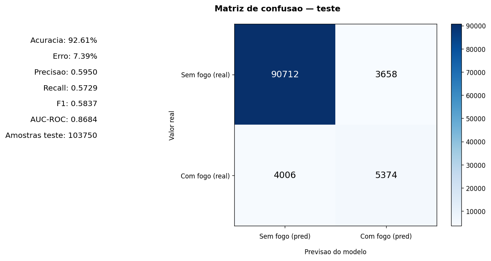

# OrbitFire

<p align="center">
  <a href="https://www.fiap.com.br/">
    
  </a>
</p>

## 👥 Integrantes:
- [Everton Marinho Souza](https://github.com/Emarinhos) — RM568137@fiap.com.br
- [Julia Gutierres Fernandes Souza](https://github.com/Juliagutierres29) — RM568296@fiap.com.br
- [Raimunda Nayara Mendes dos Santos](https://github.com/rm567718) — RM567718@fiap.com.br
- [Felipe de Souza Lourenco](https://github.com/Xaramandas) — RM567521@fiap.com.br
- [Matheus Ribeiro Martelletti](https://github.com/Martelletti27) — RM566767@fiap.com.br

## 👩‍🏫 Professores:
### Tutor(a)
- [Sabrina Otoni](https://www.linkedin.com/in/sabrina-otoni-22525519b/)
### Coordenador(a)
- [Andre Godoy, PhD](https://www.linkedin.com/company/inova-fusca)


## 📜 Descrição

O **OrbitFire** é uma POC da Global Solution FIAP 2026.1 que prevê **risco de incêndio para o dia seguinte** no **Tocantins (TO)**, cruzando detecções da NASA FIRMS com clima local. Satélites mostram onde já há fogo; gestores precisam saber **onde agir amanhã**. O sistema cobre ~4.150 células de 0,1° sobre o TO, persiste os dados em SQLite e expõe **score de risco (0–100)** e **ranking de prioridade** para brigadas via API e dashboard.

O pipeline usa **fontes diferentes para treinar e para operar**, mas o mesmo modelo LightGBM em todo o ciclo. No **treino**, FIRMS VIIRS/MODIS **SP** (jun–set/2024) e clima Open-Meteo **Archive** alimentam features, labels (fogo amanhã) e o classificador salvo em `data/models/lgbm_orbitfire.pkl`. Na **operação diária**, o modelo já treinado consome FIRMS **NRT** (últimos 5 dias) e clima **Forecast** (7 dias passados + hoje); a inferência (`predict_risk`) grava scores em `risk_scores`, o priorizador monta o ranking e a API (`/risk/map`, `/risk/ranking`) e o dashboard Streamlit exibem o resultado.

| Etapa | NASA FIRMS | Open-Meteo | Papel |
|-------|------------|------------|-------|
| Treino | VIIRS/MODIS **SP** (jun–set/2024) | **Archive** | Aprender padrões históricos e gerar labels |
| Operação | VIIRS/MODIS **NRT** (5 dias) | **Forecast** | Atualizar features e prever risco para amanhã |

### Modelo e calibragem

O LightGBM prevê **fogo amanhã** por célula. O holdout é temporal: jun–ago/2024 para treino, set/2024 para teste (502.150 linhas; ~9% de positivos no teste). Após o treino aplicamos duas calibragens:

1. **Faixas de risk score** — limites `medio`, `alto` e `critico` em `thresholds.json`, derivados dos percentis 50/75/90 das probabilidades do treino (escala 0–100).
2. **Threshold de classificação** — ponto que maximiza **F1** no teste (atualmente **0,80**), usado na matriz abaixo; distinto do corte fixo 0,50.

Em relação ao baseline inicial do TO (5 features, threshold 0,50), o modelo atual reduziu falsos alarmes de **11.656** para **3.658** no teste, mantendo recall útil (**57,3%**) para priorização. A acurácia isolada não é a métrica principal: um modelo que sempre prevê “sem fogo” já alcançaria ~90% no conjunto desbalanceado.

| Métrica | Baseline | Modelo atual |
|---------|----------|--------------|
| AUC-ROC | 0,84 | **0,868** |
| F1 (thr ótimo) | 0,45 | **0,58** |
| Falsos positivos (teste) | 11.656 | **3.658** |

#### Matriz de confusão (teste set/2024)



*103.750 amostras: TN 90.712 · FP 3.658 · FN 4.006 · TP 5.374. KPIs à esquerda do gráfico.*

Detalhes do retreino e tuning em `assets/Implementacao.md`.

**Entregas:** ingestão FIRMS e clima, grade SQLite, features/labels, modelo preditivo, risk score, priorizador de brigadas, API FastAPI, dashboard Streamlit e modo demo offline (`OFFLINE_MODE`).


## 📁 Estrutura de pastas

Dentre os arquivos e pastas presentes na raiz do projeto, definem-se:

- <b>assets</b>: Materiais do projeto (logo, escopo, implementação, edital FIAP, matriz de confusão do modelo).

- <b>src</b>: Código-fonte em camadas:
  - <b>application</b> — casos de uso (grade, features, labels, dataset)
  - <b>domain</b> — regras puras (células, features, labels, risk score)
  - <b>infrastructure</b> — adaptadores (SQLite, FIRMS, clima, ML, seed)
  - <b>api</b> — REST FastAPI (mapa, ranking, focos, health)
  - <b>dashboard</b> — painel Streamlit (consome API)
  - <b>config.py</b> — configuração central (bbox TO, paths, flags)

- <b>data</b>: Dados do OrbitFire:
  - <b>raw</b> — snapshots FIRMS (CSV) e clima (JSON)
  - <b>processed</b> — parquets de features, labels e dataset
  - <b>models</b> — modelo LightGBM, métricas, thresholds e gráficos
  - <b>seed</b> — dados para modo demo offline
  - <b>logs</b> — registros de execução local

- <b>test</b>: Testes automatizados com pytest (`test/unit/`).

- <b>README.md</b>: Guia geral do projeto (este arquivo).


## 📎 Links e Observações

> **Pendente para entrega (S7):** preencher esta seção antes do envio na plataforma.

- <b>Repositório do projeto</b>: _(link do GitHub — inserir na entrega)_
- <b>Vídeo no YouTube (até 5 min, não listado)</b>: _(inserir link)_
  - Explicação clara da integração entre disciplinas
  - Demonstração prática do funcionamento da solução
  - Postagem como **não listado**, com link anexado ao final do PDF
- <b>Decisões técnicas</b>: _(resumo das escolhas do grupo — inserir na entrega)_
- <b>Observações gerais</b>: _(competições ou demais observações, se houver)_


## 🔧 Como executar o código

> **Pendente para entrega (S7):** documentar passo a passo completo antes do envio na plataforma.

**Dashboard (prévia):** com a API no ar e scores já inferidos no SQLite, abra outro terminal na raiz do projeto:

```powershell
# Terminal 1 — API
uvicorn src.api.main:app --host 0.0.0.0 --port 8000

# Terminal 2 — painel Streamlit (http://localhost:8501)
streamlit run src/dashboard/app.py
```

O painel consome somente a API (`API_BASE_URL` no `.env`, padrão `http://127.0.0.1:8000`). Se a API estiver offline, o dashboard exibe erro com o comando para subir o servidor.

Incluir na entrega final:

- Pré-requisitos (Python 3.10+, venv, `.env`, chaves FIRMS/MAP_KEY)
- Instalação (`requirements.txt`)
- Comandos para ingestão, pipeline de modelagem, API e dashboard
- Modo demo offline (`OFFLINE_MODE`)


## 📋 Licença

<p xmlns:cc="http://creativecommons.org/ns#" xmlns:dct="http://purl.org/dc/terms/"><a property="dct:title" rel="cc:attributionURL" href="https://github.com/SabrinaOtoni/TEMPLATE-FIAP-GRAD-ON-IA">MODELO GIT FIAP</a> por <a rel="cc:attributionURL dct:creator" property="cc:attributionName" href="https://fiap.com.br">FIAP</a> está licenciado sobre <a href="http://creativecommons.org/licenses/by/4.0/?ref=chooser-v1" target="_blank" rel="license noopener noreferrer" style="display:inline-block;">Attribution 4.0 International</a>.</p>
